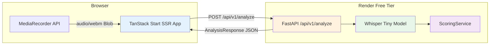

# Livo Pronounce AI — System Architecture

## Project Overview

Livo Pronounce AI is a pronunciation assessment application that lets users upload or record short audio clips and receive an AI-generated report covering clarity, fluency, confidence, and speaking speed. The system is designed for a stateless, session-only workflow — audio is processed in memory on the server and never persisted.

The project was built as a two-person engineering effort over a 6-week period and is deployed on free-tier infrastructure (Vite-powered frontend on Vercel, FastAPI backend on Render).

---

## System Architecture

**Request flow.** The user uploads or records audio from the browser. On clicking "Analyze speech," the frontend sends a `multipart/form-data` POST to the FastAPI backend. The backend validates the file (MIME type, size, duration), transcribes it with Whisper, scores the transcription, and returns a structured JSON response.

---

## Components and Connections

| Layer | Component | Role |
|---|---|---|
| Frontend | TanStack Start + React 19 | SSR-rendered SPA; state machine drives 5 UI states (idle → ready → analyzing → results/error) |
| Frontend | `useRecorder` hook | Wraps `MediaRecorder` + `AnalyserNode` for in-browser capture; returns waveform levels and a `Promise<Blob>` on stop |
| Frontend | `Workspace` component | Dual-panel upload/record; runs client-side duration validation via the `Audio` API before allowing submission |
| Backend | FastAPI on Render | Single-process, stateless; lazy-loads Whisper model on first request |
| Backend | `validate_audio` (security.py) | Rejects files exceeding 5 MB or with MIME types outside a strict allowlist |
| Backend | `speech_service` | Writes audio to a temp file, runs Whisper `transcribe()`, deletes temp file in `finally`; returns words with per-word probabilities and timestamps |
| Backend | `ScoringService` | Pure computation — no I/O. Derives clarity, fluency, filler penalty, and word-level feedback from transcription data |

---

## Models & APIs Used

**Whisper Tiny** (via `faster-whisper`). Chosen over larger variants (base, small, medium) because the dominant latency factor on Render's Free tier is the platform cold start (30–60 s), not inference time. Once the model is loaded, a single forward pass through Tiny with `beam_size=1` completes in under 15 s for a 30 s audio clip. Larger models would recover a few percentage points of accuracy at the cost of doubling both load and inference time, which is unacceptable on free infrastructure.

**API surface.** The backend exposes exactly one authenticated endpoint: `POST /api/v1/analyze`. A `GET /health` endpoint is used by the Render platform's health-check pings.

---

## Pronunciation Scoring Methodology

The scoring system maps the raw per-word probabilities from Whisper onto five metrics:

- **Clarity.** The arithmetic mean of all per-word Whisper confidence scores. This directly reflects how well the acoustic model matched each phoneme sequence.
- **Fluency.** A function of words-per-minute (WPM). 110–160 WPM is scored as perfect (1.0); outside this range the score decays linearly to a floor of 0.5.
- **Confidence.** Displayed as `clarity × 100`. A separate signal for the UI rather than a distinct model output.
- **Filler penalty.** A lookup against a hardcoded set of filler words ("um", "uh", "like", etc.). Each occurrence deducts 2 % from the overall score, capped at a 10 % penalty.
- **Overall score.** `clarity × 0.65 + fluency × 0.35 – filler_penalty`. The weights prioritise clarity over speed because mispronunciation degrades listener comprehension more than a slightly fast or slow pace.

---

## DPDP Compliance

The application is designed for the Indian Digital Personal Data Protection (DPDP) Act:

- **Consent.** The frontend requests microphone permission via the browser's `getUserMedia` dialog. No personal data is collected beyond the uploaded audio.
- **Storage.** Audio is written to a temporary file during transcription and deleted in a `finally` block. No database or object store is used. The system is stateless by design.
- **Retention.** Data exists in memory for the duration of a single request (typically <30 s). No retention policy is needed because nothing is retained.
- **Security.** CORS is locked to known origins. File uploads are validated by MIME type (allowlist) and size (5 MB cap). The application has no user accounts, no authentication tokens, and no stored secrets — the attack surface is minimal.
- **Data residency.** The backend runs in a single Render region (Oregon, US). For a production deployment targeting Indian users, a Mumbai-based server would be required.
- **Deletion.** Because audio is never saved, there is nothing to delete. The response payload (transcription and scores) is transient in the browser's memory and is discarded on page refresh or navigation.

---

## Trade-offs

- **Whisper Tiny accuracy vs. latency.** Tiny's word-error rate is measurably higher than Small or Medium, but on free-tier infrastructure the difference is irrelevant if the container takes 45 s to wake up. Once the platform cold start is eliminated (paid tier), swapping to `base` or `small` would be the single highest-leverage improvement.
- **English-only.** Whisper supports 99 languages, but we restrict to `["en"]` and reject others with a 400 response. This avoids nonsensical scoring for languages where per-word confidence is not a meaningful proxy for pronunciation quality.
- **No caching.** Every request runs a full inference pass. An LRU cache keyed on file hash could skip re-analysis of identical clips during the same session, but the complexity was not justified for v1.
- **Filler detection is rule-based.** A hardcoded set of eight filler words misses regional variants and context-dependent fillers. A small classifier would improve recall, but the rule-based approach is transparent and trivially auditable.

---

## Future Improvements

| Area | Improvement | When |
|---|---|---|
| **Scoring** | Replace weighted average with a phoneme-level pronunciation model (e.g., Wav2Vec2 fine-tuned on L2 English) | v2 |
| **Infrastructure** | Move to a paid Render tier or a reserved-instance VM to eliminate cold starts | Post-internship |
| **Caching** | Add response caching (Redis or in-memory LRU) for repeated uploads | v1.1 |
| **Language** | Support multilingual scoring with language-specific phoneme maps | v2 |
| **Feedback** | Generate natural-language suggestions using an LLM instead of template strings | v1.5 |
| **Monitoring** | Add structured logging to a central sink (Logtail, Axiom) for debugging and usage analysis | v1.1 |
| **CI/CD** | Add automated tests for the scoring edge cases and a GitHub Actions deploy pipeline | v1.1 |
